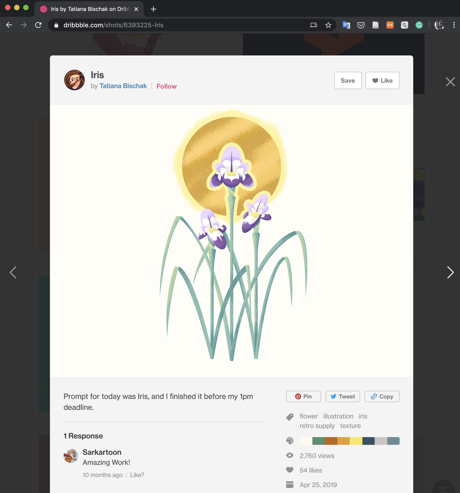
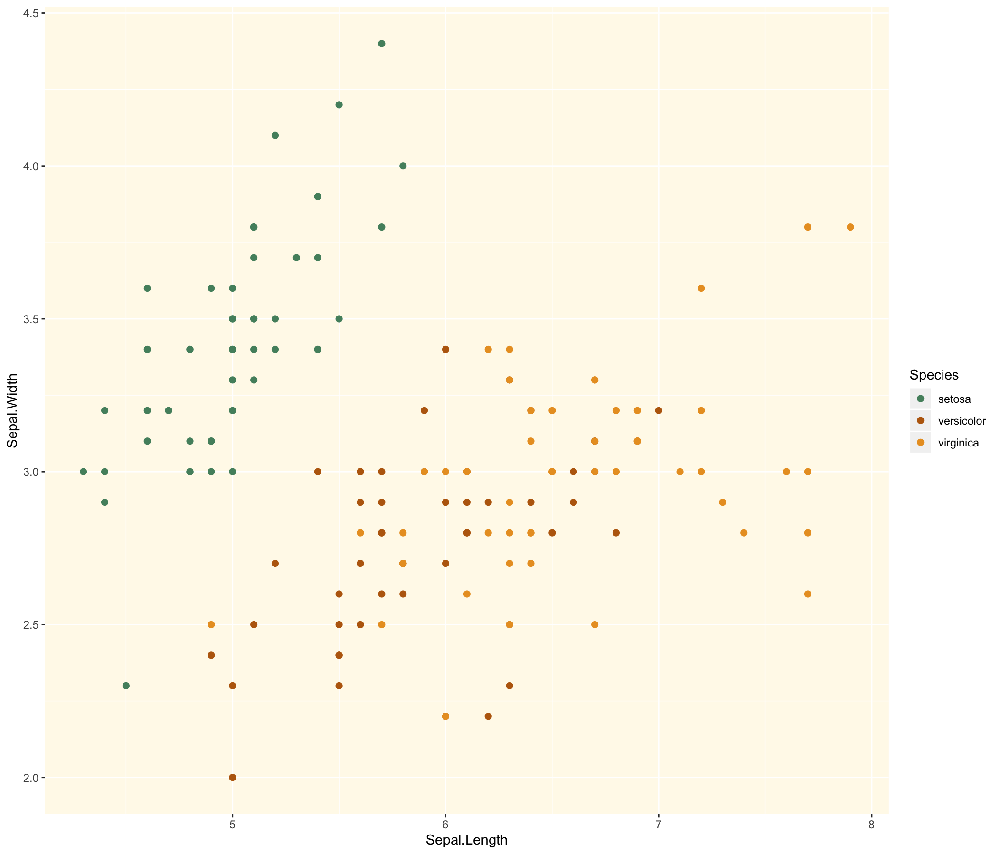
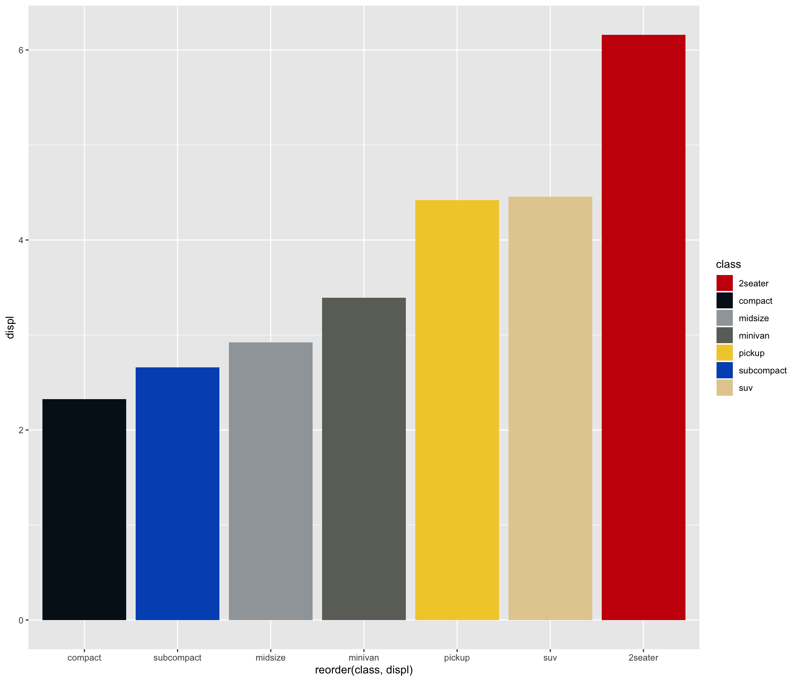
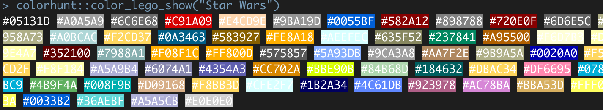

# colorhunt
The package hunt (scraping) the color code from https://dribbble.com/, then generate the color palette.

## Installation
```
# install.packages("remotes")
remotes::install_github("adatalab/colorhunt")
```

## Usage
### First step
Find the **COLOR INSIGHT** for your plot at https://dribbble.com/. For example, I found the `iris` images at https://dribbble.com/shots/6393225-Iris.



### color_hunt()
Import the colors from dribbble!
```
colors <- color_hunt(url = "https://dribbble.com/shots/6393225-Iris")

iris %>%
  ggplot(aes(Sepal.Length, Sepal.Width, color = Species)) +
  geom_point(size = 2) +
  scale_color_manual(values = colors[-1]) +
  theme(
    panel.background = element_rect(fill = colors[1])
  )
```


  

### color_lego()  
This function make palette from the color dataset from 379 LEGO series. `list_lego` shows the list of LEGO series.

```
colors <- color_lego("Ferrari")

mpg %>%
group_by(class) %>%
  summarise(displ = mean(displ)) %>%
  ggplot(aes(reorder(class, displ), displ, fill = class)) +
  geom_col() +
  scale_fill_manual(values = color_lego("Ferrari"))
```



### color_lego_show()  
Before the choice of the LEGO series. You can check the colors of the LEGO color dataset at the command line.

```
color_lego_show("Star Wars")
```


## Getting helps
- For help or issues using colorhunt, please submit a GitHub [Issue](https://github.com/adatalab/colorhunt/issues).  
- For personal communication, please contact Youngjun Na (ruminoreticulum@gmail.com).
