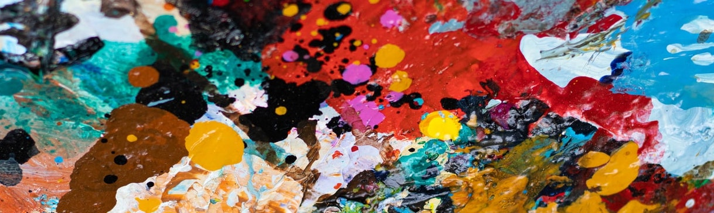
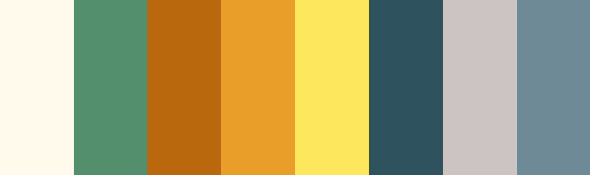
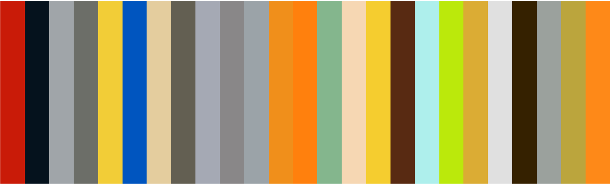

# colorhunt

The package hunt (crawling) the color HEX codes from https://dribbble.com/, then generate the color palette.

## Installation
```
# install.packages("remotes")
remotes::install_github("adatalab/colorhunt")
```

## Usage
### First step
Find the **COLOR INSIGHT** for your plot at https://dribbble.com/. For example, I found the `iris` images at https://dribbble.com/shots/6393225-Iris.


### color_hunt()
Import the colors from dribbble using `color_hunt()`! For reproducibility, color codes are going to copy to your clipboard. Paste (Ctrl + V) the color code into your script. There is no need to crawling every time.

```
library(colorhunt)
library(ggplot2)
library(dplyr)

# Good! But, in this way, you use the resources every time.
colors <- color_hunt(url = "https://dribbble.com/shots/6393225-Iris")

# Great! Just push the Ctrl + V button!
color_hunt(url = "https://dribbble.com/shots/6393225-Iris")
colors <- c('#FFFAEB', '#538F6D', '#BA680D', '#E99E29', '#FDE75C', '#2F545F', '#CBC4C3', '#6D8A96')

pals::pal.bands(colors)
```



```
iris %>%
  ggplot(aes(Sepal.Length, Sepal.Width, color = Species)) +
  geom_point(size = 2) +
  scale_color_manual(values = colors[-1]) +
  theme(
    panel.background = element_rect(fill = colors[1])
  )
```


  

### color_lego()  
This function make palette from the color dataset from 379 LEGO series. `list_lego` shows the list of LEGO series.

```
colors <- color_lego("Ferrari")

pals::pal.bands(colors)
```



```
mpg %>%
group_by(class) %>%
  summarise(displ = mean(displ)) %>%
  ggplot(aes(reorder(class, displ), displ, fill = class)) +
  geom_col() +
  scale_fill_manual(values = color_lego("Ferrari"))
```


### color_lego_show()  
Before the choice of the LEGO series. You can check the colors of the LEGO color dataset at the command line.

```
color_lego_show("Star Wars")
```


## Getting helps
- For help or issues using colorhunt, please submit a GitHub [Issue](https://github.com/adatalab/colorhunt/issues).  
- For personal communication, please contact Youngjun Na (ruminoreticulum@gmail.com).
